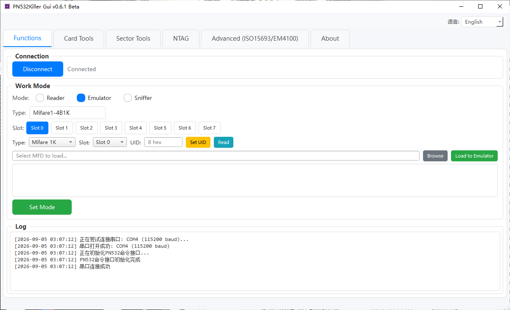
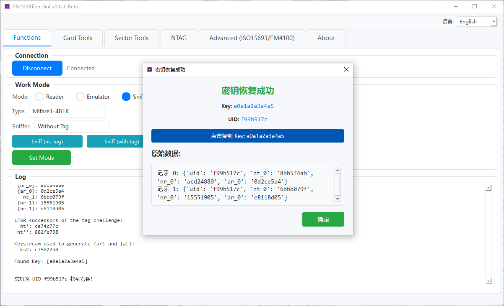
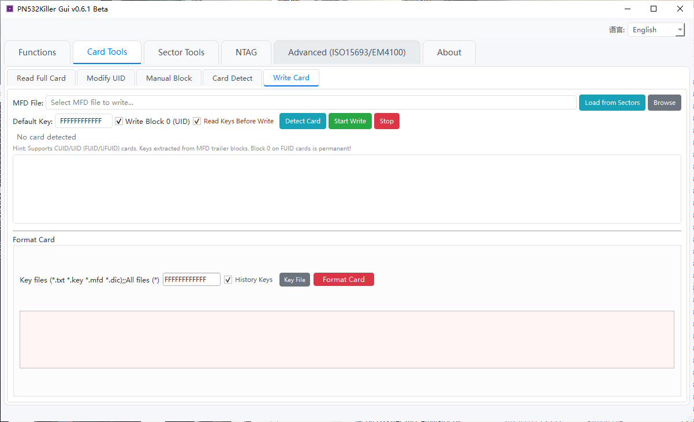

# PN532Killer Gui

---

## Screenshots

<p align="center">
  
</p>

<p align="center">
  
</p>

<p align="center">
  
</p>

---

## Introduction

**PN532Killer Gui** is a graphical NFC tool designed for the **PN532Killer hardware device**. It requires the corresponding hardware and official firmware to function.

It provides visualized operation capabilities for three working modes: Reader, Emulator, and Sniffer. It offers full-featured MIFARE Classic card reading/writing, key recovery, and data editing, making it suitable for NFC security research, testing & analysis, and educational demonstrations.

---

## Features

### Reader Mode

- **Full MIFARE Classic Dump** — Dictionary attack + key propagation + failure retry; supports historical keys and custom key files
- **UID Modification** — Detects card type and writes a new UID (CUID cards supported)
- **Manual Block R/W** — Read/write a single data block by specifying the block number and key
- **Card Type Detection** — Automatically identifies Gen1A/Gen3/Gen4 magic cards, standard MIFARE Classic, NTAG, etc.
- **Card Writing** — Write from MFD files or sector data; supports writing block 0
- **Card Formatting** — One-click reset to factory default keys and blank data

### Emulator Mode

- Supports MIFARE Classic 1K, NTAG, and ISO15693 card emulation
- 8 independent slots to preload multiple card datasets and switch quickly
- Real-time UID setting and MFD file loading

### Sniffer Mode

- **Tagless Sniffing** — Capture reader-side communication data
- **Tagged Sniffing** — Record the complete interaction between reader and card
- Integrated `mfkey64` / `mfkey32v2` to automatically analyze sniffed data and recover keys

### Sector Tools

- Tree-view browsing and editing of sector data
- Real-time hex data validation and modification
- Import MFD / text files with automatic format detection
- Extract keys from sector trailers and save to history
- Sector content analysis (trailer/data block identification)

---

## System Requirements

- Windows or Linux 64-bit
- Serial port driver (CH340 / CH343 / CP2102, etc.)
- Python 3.9+ (for running from source)

---

## Installation

### Option 1: Run from Source

```bash
# Clone the repository
git clone https://github.com/yuwan-jpg/PN532Killer-Gui.git
cd PN532Killer-Gui

# Install dependencies
pip install -r requirements.txt

# Launch the GUI
python pn532_gui.py
```

### Option 2: Pre-built Release

Download the latest executable from the [Releases](https://github.com/yuwan-jpg/PN532Killer-Gui/releases) page and run directly.

---

## Build from Source

Refer to [BUILD_GUIDE.md](BUILD_GUIDE.md) for detailed build instructions using PyInstaller.

Quick build:
```bash
# Windows
pyinstaller pn532_gui.spec

# Linux
pyinstaller pyinstaller_linux.spec

# macOS
pyinstaller pyinstaller_macos.spec
```

---

## Resources

- **Official Firmware**: https://github.com/NFC-funs/PN532Killer
- **Related Website**: https://www.pn532killer.com

---

## Disclaimer

- This project is intended **solely for research and testing of NFC devices or cards that you legally own or are explicitly authorized to test**.
- Any unauthorized or illegal use is strictly prohibited.
- Users assume full responsibility for their use of this tool and any consequences arising from it.

---

## ⚠️ Notice

**This is a Beta release and may contain instability and unknown issues.** You may encounter functional anomalies, write failures, or other unexpected problems during use. It is recommended to **back up your card data** before performing critical operations and to use with caution in production environments. If you encounter any issues, please submit them via [Issues](https://github.com/yuwan-jpg/PN532Killer-Gui/issues).

---

## License

This project is licensed under the **MIT License** — see the [LICENSE](LICENSE) file for details.

Copyright © 2026 **yuwan-jpg**
